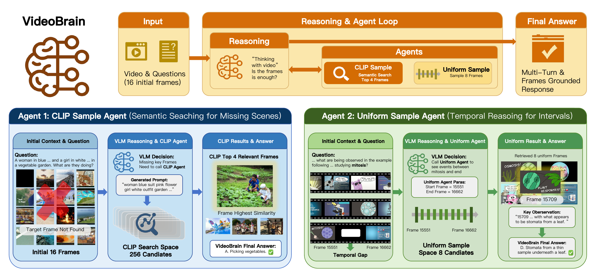
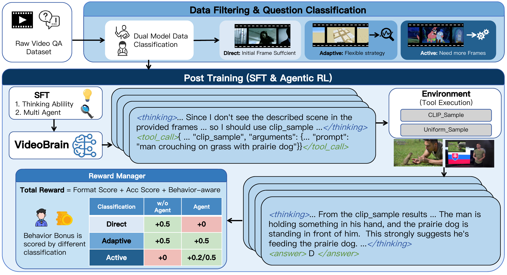

# VideoBrain: Learning Adaptive Frame Sampling for Video Understanding

[](https://arxiv.org/abs/2602.04094)

Junbo Zou, Ziheng Huang, Shengjie Zhang, Liwen Zhang, Weining Shen

---

## 🔥 Update

- **[2026.5]** Our paper has been accepted to **ICML 2026**!

---

## Overview

Long-form video understanding remains challenging for VLMs due to the tension between computational constraints and the need to capture information distributed across thousands of frames. Existing approaches either sample frames uniformly (risking information loss) or select keyframes in a single pass (with no recovery from poor choices).

**VideoBrain** solves this with dual complementary agents and a behavior-aware reward function:



- **CLIP Sample Agent** — semantic retrieval across the video (finds specific visual content regardless of temporal location)
- **Uniform Sample Agent** — dense temporal sampling within intervals (captures fine-grained sequential information)

Unlike prior agent-based methods that rely on text-only LLMs orchestrating visual tools, our VLM directly perceives frames and reasons about information sufficiency — truly **"thinking with video."**

---

## Training Pipeline



Training uses a two-stage process:

1. **Data Classification** — A dual-model pipeline classifies video QA samples into three categories based on whether agent invocation is beneficial:
   - **Direct**: Initial frames are sufficient; agent calls not needed
   - **Adaptive**: Model capability gap; either strategy may help
   - **Active**: Additional visual information is genuinely required

2. **Supervised Fine-Tuning (SFT)** — Cold-start training on teacher-generated trajectories for Adaptive and Active samples, teaching reasoning and tool usage

3. **Reinforcement Learning (GRPO)** — Refines agent usage policy with a **behavior-aware reward** that prevents reward hacking by discouraging unnecessary agent calls on Direct questions while encouraging exploration on Active ones

---

## Installation

```bash
# Clone the repository
git clone https://github.com/Jacob-Chow/VideoBrain.git
cd VideoBrain

# Install dependencies
pip install -r requirements.txt
```

### Core Requirements

```
Python >= 3.10
PyTorch >= 2.4.0
vLLM == 0.11.1
transformers == 4.57.1
```

### Download Vision Model

Download the SigLIP2 model for CLIP-based frame retrieval:

- **Model**: [`google/siglip-so400m-patch14-384`](https://huggingface.co/google/siglip-so400m-patch14-384)
- **Place at**: `examples/agent/clip_module/SigLIP2_ViT/`

---

## Inference

### Run

```bash
python examples/agent/infer.py
```

---

## Training

Training uses [verl](https://github.com/volcengine/verl) for distributed GRPO. The base model is **Qwen3-VL-8B-Instruct**.

### Training Data

~8K samples curated from:
- [Video-Holmes](https://github.com/TencentARC/Video-Holmes)
- [CG-Bench](https://github.com/CG-Bench/CG-Bench)
- [NExT-QA](https://github.com/doc-doc/NExT-QA)
- [MLVU](https://github.com/JUNJIE99/MLVU)
- [LongVideo-Reason](https://huggingface.co/datasets/longvideoreason)

Split: ~1.6K for SFT, ~6.4K for RL, both trained for 1 epoch.

### Infrastructure

8× H20 GPUs, ~472 GPU hours total.

---

## Acknowledgements

This work builds upon [verl](https://github.com/volcengine/verl), [DeepEyes](https://github.com/Visual-Agent/DeepEyes), [FrameThinker](https://github.com/lcqysl/FrameThinker), PyTorch, Transformers, vLLM, and Qwen-VL. All third-party code retains its original license.

---

## Citation

```bibtex
@inproceedings{videobrain2026,
  title     = {VideoBrain: Learning Adaptive Frame Sampling for Video Understanding},
  author    = {Junbo Zou and Ziheng Huang and Shengjie Zhang and Liwen Zhang and Weining Shen},
  booktitle = {Proceedings of the 43rd International Conference on Machine Learning (ICML)},
  year      = {2026},
}
```
